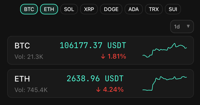

Just a simple crypto price ticker. 
It has always-on-top window for macOS. 



### Some stuff you need

- Go 1.16 or higher
- macOS (for native window support), maybe it will work on other systems, who knows

### Mega guide

```bash
git clone https://github.com/yourusername/crypticker.git
cd crypticker
go mod download
go build
./crypticker
```

### License

[MIT License](LICENSE)
